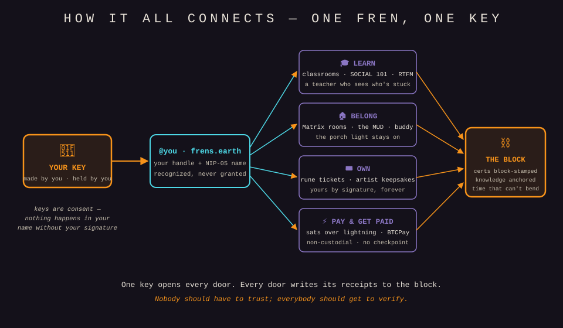
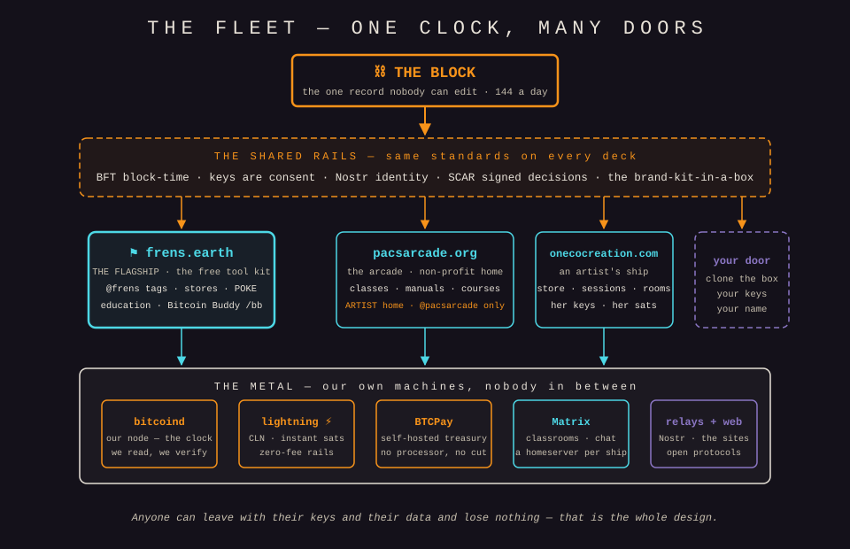

# Pac's Arcade — A White Paper

*0018.04.15 a₿ · This document wears block time, like all of ours do.*

*Pac's Arcade is a Bitcoin-education non-profit (501(c)(3), Ohio). We are building a sovereign earthship for frens — a place to learn sound money, keep your own keys, and preserve what you know so it can't be quietly deleted. This is the paper for anyone deciding whether to join us, fund us, or build with us.*

## TL;DR

> **Your money is printed. Your calendar is edited. Your knowledge is rented.**
>
> We're building the exit. Pac's Arcade — a non-profit arcade where you learn sound money, hold your own keys, and write what you know onto the one record no authority can erase. Free classes. Free manuals. A name that's yours because the key is yours. Time told in blocks — 144 a day, the same for every soul on earth.
>
> No fees. No checkpoints. No one left in the corner.
>
> **Tick tock — it all comes back to the block.**

---

## Abstract

Somewhere along the way, the tools most people use to live were handed a landlord. The money is printed by strangers. The calendar has been edited by emperors and popes. The knowledge is rented from platforms that can revoke it on a Tuesday. The door to the financial system asks for your papers before it asks your name.

Bitcoin is the light. It is the first money nobody can quietly print, the first clock nobody can bend, the first ledger you can check yourself instead of being told to trust. Twenty-one million, and never one more — every sat is a fraction of a fixed whole, **∞/21M**, the infinite divisibility of a supply nobody can grow. Moon time, then — our calendar starts on a new moon. That's how we hack the planet, together. **The developers have their turn to design a world guided by sound money — a source of truth.** Pac's Arcade is one turn, taken: a small non-profit building a suite of free, open tools that teach Bitcoin, preserve knowledge on-chain, and give ordinary people their own keys, their own handle, and their own time. No gatekeepers. No seat that gets sold out from under you. And — the whole reason we started — **no one gets left in the corner.**

Nobody should have to trust; everybody should get to verify.

---

## The Problem

**Broken money.** An hour of your work is measured in a unit that whoever holds the printer can dilute while you sleep. Save in it and you're running up a down escalator. The game is rigged before you sit down, and most people are never told the rules.

**Stolen time.** Governments have edited time out from under the people who lived on it — that's not a slogan, it's a record. A pope deleted ten days from October 1582, and over the next three centuries the rest of the world fell in line. Daylight saving moves your hour twice a year and never asks. The 40-hour week is measured on a calendar the people being measured never controlled. When the one who owns the clock also owns your hours, you don't own your hours.

**Knowledge with a landlord.** What you learn, write, and build lives on platforms that can delete it, de-rank it, or lock you out — no appeal, no receipt, no forwarding address. A life's worth of knowledge can vanish because a policy changed or a company folded. Rented memory is not memory.

**KYC gatekeeping.** The front door to sound money increasingly asks for your identity, your papers, and your permission-to-exist before it lets you in — a checkpoint that turns a tool for everyone into a privilege for the approved. The people who most need an exit from broken money are the ones the checkpoint turns away.

**The news that won't report the good.** The quiet, real progress — people learning to self-custody, communities keeping their own records, kids who now understand what a block is — doesn't sell fear, so it doesn't get told. So we tell it ourselves, and we teach people to check it themselves.

---

## The Mission

We exist to **preserve knowledge and tie it to the block, forever** — to take what a community knows and anchor it to the one record no authority can edit, so it outlives the platform, the company, and the news cycle. A block height is a timestamp nobody can revise. We date the truth to it. We call ourselves the defenders of the block, and this is the watch we keep.

Two convictions hold up everything we build:

**Keys are consent.** You hold your own keys; nothing happens in your name without your signature. Identity here is not an account we grant and can revoke — it's a key you own and we merely recognize. Sign-off, membership, ownership, a ticket in your name: each is a signature you made, verifiable by anyone, revocable by no one but you.

**No one gets left in the corner.** This is the rescue-buddy ethos, and it's the oldest thing about us. The arcade is a place, and a place looks after the people in it. We build the check-in, the porch light, the hand on the shoulder into the software itself — because a tool that teaches sound money and forgets the person using it has missed the point. We teach, we don't preach. We hand people the keys and stay in the room.

---

## What We Build

A suite of free, open, self-hostable tools. Each stands alone; together they're an earthship you can move into.

**frens.earth** — the front door. A Bitcoin handle and a Nostr identity you actually own: claim your `@frens` tag, get a NIP-05 name, sign in with your key. No email, no password to leak, no account to be suspended. Your name is yours because your key is yours.

**The MUD** — knowledge preservation tied to the block. A living, text-native world where what a community knows is written down, kept, and anchored to the chain so it can't be silently lost. Part game, part library, part time capsule — knowledge you can walk through, dated to the one record that doesn't forget.

**RTFM** — the manuals. Read The Full Manual (the house expansion — you already know the traditional one): plain, illustrated, honest walkthroughs of the hard parts — your first deployment, rescuing a treasury, running your own node — written so a sharp five-year-old can follow and a grown-up still learns something. Every manual carries a review-due stamp and announces its own age; we never let a manual rot in silence.

**Bitcoin Federated Time (BFT)** — the house clock. We tell time in blocks, not in a calendar somebody can edit (its own section below). Every page, ticket, cert, and log in the suite wears block time.

**Classrooms & courses** — SOCIAL 101, the wallet courses, and moderated classrooms where people learn Nostr, self-custody, and sound money at their own pace, in their own room, with a teacher who can see who's stuck. Graduation is block-stamped. The lesson a learner trips on becomes the next lesson we fix.

**Bitcoin Buddy (`/bb`)** — the porch light, with a pet inside. A little companion born on a block — its birthday is a height on the chain — that needs looking after, and looks after you back, in the rescue-buddy spirit: shares a fact, checks in, never nags — a gift, never a guilt trip. The software remembering the person, and the person remembering it.

**Rune-ticket events** — event tickets done right: one rune per event or concert series, each unit a ticket AND a collectable, tied to your name by a signed attestation. Check-in is one signature — no scanner overlord, no custodial middleman. Fees go to the artist at mint; resale rules are the venue's own; provenance lives on-chain forever. Rarity is minted by the block itself.

**The artist registry** — a home for artists to register a name, show work, and issue keepsakes whose rarity is set by Bitcoin Time, not by a marketing department. Provenance is public and permanent; the artist keeps the keys and the fees.

**The brand-kit-in-a-box** — the whole earthship as a template. Everything above ships as a package another community can stand up under its own name, its own keys, its own door — plug-and-play modules, so a co-op or a classroom or an arcade can run the full suite without asking us for permission. One fleet, many doors.

---

## How It's Funded

We're a non-profit, and we intend to stay one.

- **Donations, including bitcoin.** We're standing up our own self-hosted treasury to take sats directly — no processor, no cut, no KYC checkpoint between a supporter and the mission. Dollars welcome too.
- **Grants for open-source work.** Everything we build is free and open source — MIT or AGPL-3.0, always self-hostable — squarely in scope for Bitcoin FOSS funders like Spiral and the broader grant ecosystem that exists to keep this software free and unowned.
- **No KYC gatekeeping, on principle.** We will not build a checkpoint we exist to remove. Our tools are non-custodial by default; we don't operate an exchange or an escrow, and we bring counsel before we go near anything that would make us a middleman.

Every dollar and every sat serves one mission: free tools, free lessons, and knowledge kept on the block for the people who need it — and the unglamorous bills that make it real: the servers and their backups, fair pay for working hands, and artists paid for their art.

---

## Governance & Sovereignty

Authority here is a key, not a title. Decisions that matter are **signed** — a sign-off is a key-signed Nostr event, verifiable by anyone and forgeable by no one. High-stakes actions require **more than one key**, so no single hand can move the ship alone. The approvals happen at **SCAR**, the house console, where every change is proposed, reviewed, signed, and logged — and the ship's log is append-only, so the record of who decided what, and when, is itself on the block.

The structure is **a fleet**: a flagship (frens.earth) and a growing set of sister sites, each sovereign under its own keys, each able to run the full suite, all sharing the same standards and the same clock. Captains run their own decks; the flagship key signs the highest-stakes calls; the record is public. And everyone aboard is a fren — the work is a game, and every hand that does it earns: cadets level up, crews collect commendations, and even our AI shipmates earn their achievements and their ceremonies. Sovereignty isn't a slogan on the box — it's the fact that anyone can leave with their keys and their data and lose nothing.

---

## The Time

We don't tell time on a calendar anyone can edit. We tell it in **blocks**.

On January 3rd, 2009, at height zero, time got a heartbeat nobody can rob: **144 blocks a day, the same for every soul on earth** — no time zones, no daylight saving, no committee, no pope. Bitcoin Federated Time reads that height as a calendar and a clock. **Year 0 is 2009**, so the year on the clock is simply Bitcoin's age — we're in year 18. Thirteen months of twenty-eight days, 52,416 blocks to the year, the same for everyone, forever.

This is the house's own standard, and it's more than lore: it's how we keep our promise. Dating a thing to a block is what makes "preserved forever" a fact instead of a wish. Every manual, every cert, every ticket, every entry in the log wears block time — because the block is the one thing on earth we can all check and none of us can bend. We run our own node, and every clock we ship is being wired to read it first — public explorers as the honest fallback — so the time we serve comes from a machine we hold, not a stranger's. (The clock itself is published: github.com/PacsArcade/bitcoin-federated-time — check our math.)

The calendar formally begins at **Day 0** — the **real** new moon nearest Bitcoin's eighteenth birthday (~7 January 2027, 20:24 UTC — check any almanac) — when we reset the clock at Bitcoin-midnight and start counting from zero. We're on moon time now.

The old calendar is burned. We're not asking for it back.

---

## The Ask

Here's where you come in, fren.

- **Join.** Claim your handle at frens.earth. Bring your frens.
- **Learn.** Take SOCIAL 101, run your birthday in Bitcoin time, read a manual — free, honest, at your pace.
- **Build.** It's all open. Clone the box, stand up your own door, check our math, tell us loudly if a number's wrong. *Nobody should have to trust; everybody should get to verify.*
- **Donate.** Sats or dollars, for free tools and free lessons for people the checkpoint turned away.
- **Teach.** The best thing you can do with sound money is hand it to the next person. We'll give you the manuals.

We're a small non-profit building a place where money is honest, time can't be bent, knowledge doesn't have a landlord, and nobody gets left in the corner.

Tick tock — it all comes back to the block.

---

*Pac's Arcade · a 501(c)(3) non-profit, Ohio · built in the open, free and open source · frens.earth*
